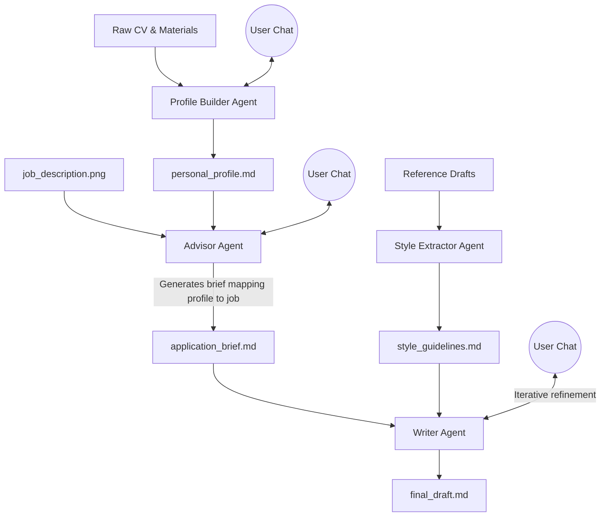

# Interactive Multi-Agent Cover Letter System

We are building a chat-based, multi-agent interactive application using Streamlit from scratch. This system manages your personal profile, extracts your writing style, and splits the cover letter generation process into an Advisor discussion phase and an iterative Writer drafting phase.

## 1. Create Knowledge Base & Data Folders

We will set up a fresh directory structure to separate your raw inputs, personal information, system knowledge, and the active workspace.

- Create `raw_materials/` to hold your raw CVs, LinkedIn exports, and other background documents.
- Create `raw_materials/reference_drafts/` to hold your past cover letters for style extraction.
- Create `my_info/personal_profile.md` for your structured CV, interests, background, and experiences.
- Create `knowledge/writing_strategies.md` for AI writing style rules.
- Create a `workspace/` folder that holds the active `job_description.png` (or `.jpg`), `advisor_chat_log.md`, `application_brief.md`, and `final_draft.md`.

## 2. Python Architecture & Agents

We will build distinct modules for the application's logic. All agents must define a clear **System Prompt** defining their role, constraints, and required output formats (e.g., using Structured JSON where applicable).

- **Knowledge Base (`src/kb.py`)**: Handles reading from and writing to the data directories. Needs robust error handling if files are missing.
- **LLM Client (`src/llm.py`)**: Handles API calls to the LLM (e.g., OpenAI or Anthropic). **Must support Vision capabilities** to parse job description screenshots, alongside multi-turn chat history management, system prompts, and structured JSON output.
- **Profile Builder Agent (`src/profile_builder.py`)**: Ingests files from `raw_materials/` (like your CV) and interacts with you to extract, format, and continuously update your `personal_profile.md`. Should be capable of appending new experiences rather than just overwriting.
- **Style Extractor Agent (`src/style_extractor.py`)**: Analyzes past cover letters from `raw_materials/reference_drafts/` to learn your tone, vocabulary, formatting preferences, and document structure (e.g., header, intro, body, closing), generating or updating `knowledge/writing_strategies.md`.
- **Advisor Agent (`src/advisor.py`)**: Takes the job description screenshot and your `personal_profile.md`. It engages in a multi-turn conversation with you to evaluate if the job aligns with your interests and select relevant experiences. Once you decide to apply, it outputs a highly structured `application_brief.md` which maps specific profile experiences to specific job requirements.
- **Writer Agent (`src/writer.py`)**: Reads the `application_brief.md` and applies rules from `writing_strategies.md` to generate the initial draft. It then engages in a **multi-turn chat with you** to iteratively refine and polish the `final_draft.md`.

## 3. Build a Streamlit Web UI

We will build a lightweight graphical interface to facilitate the entire pipeline. Streamlit's `st.session_state` will be crucial here to manage the complex, multi-agent state across different tabs and chats without losing history on rerenders.

- Add Streamlit to `requirements.txt`.
- Create a new file `app.py` in the root directory.
- **UI Sections (Tabs):**
  - **1. Profile Builder**: Upload raw materials/CVs to chat with the Profile Builder and view/edit the resulting `personal_profile.md`.
  - **2. Style Extractor**: Upload reference drafts and trigger the Style Extractor to view/edit `writing_strategies.md`.
  Instead of a separate app, each agent is a **Cursor Rule** (`.cursor/rules/`). You run each step directly in Cursor's Agent chat using `@file` references. No API key or external server needed — powered entirely by your Cursor Pro plan.

| Rule File                | Agent               | How to Trigger                                                        |
| ------------------------ | ------------------- | --------------------------------------------------------------------- |
| `01-profile-builder.mdc` | Profile Builder     | `@raw_materials/cv.txt` + `@my_info/personal_profile.md`              |
| `02-style-extractor.mdc` | Style Extractor     | `@raw_materials/reference_drafts/` + `@knowledge/style_guidelines.md` |
| `03-advisor.mdc`         | Application Advisor | attach job screenshot + `@my_info/personal_profile.md`                |
| `04-writer.mdc`          | Cover Letter Writer | `@workspace/application_brief.md` + `@knowledge/style_guidelines.md`  |

## Architecture Flow

