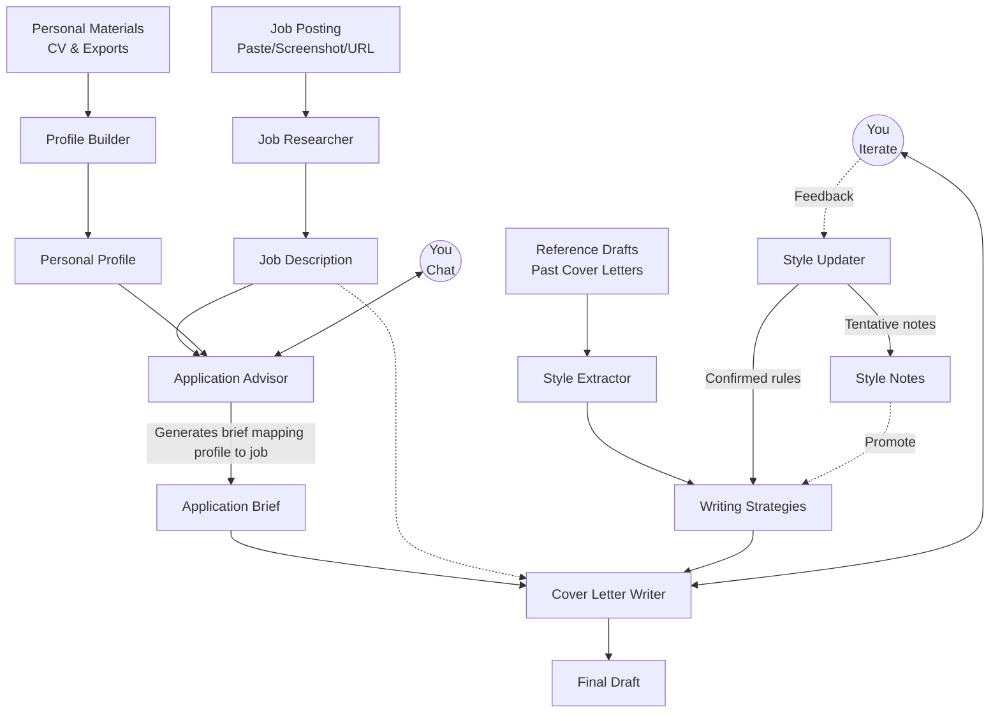
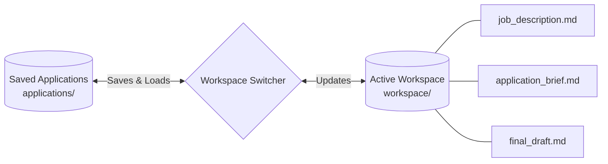

# Cover Letter Assistant

A personal, multi-agent cover letter pipeline that runs entirely inside **Cursor** — no API keys, no external services. Powered by your Cursor Pro plan.

Each agent is a Cursor Skill that reads and writes structured markdown files. You interact with them through natural language in Cursor's Agent chat.

---

## Architecture

### Main Pipeline



### Workspace Management



---

## How it works

The system is built around two types of memory:

| Type | Files | Purpose |
|---|---|---|
| **Global** | `my_info/`, `knowledge/` | Your profile and writing strategies — shared across every application |
| **Per-application** | `workspace/` | Active job context — swapped out when you switch applications |

---

## Project structure

```
my_info/
    personal_profile.md         ← Your CV, experiences, and skills
raw_materials/
    personal_materials/
        your_cv.pdf / your_cv.md    ← Raw inputs for the profile builder
    job_description/
        posting.pdf                 ← Raw job description inputs
    reference_draft/
        past_letter.pdf             ← Past cover letters for style analysis
knowledge/
    writing_strategies.md       ← Hard memory: confirmed writing rules
    style_notes.md              ← Soft memory: tentative observations
workspace/
    .active                     ← Current application slug
    job_description.md          ← Enriched job + company intelligence
    application_brief.md        ← Tailored strategy for this application
    final_draft.md              ← The cover letter
applications/
    stripe-backend/             ← Saved snapshots of past applications
    google-swe/
    ...
```

---

## Agents (Cursor Skills)

| Skill | What it does |
|---|---|
| `profile-builder` | Builds `personal_profile.md` from your CV or career materials |
| `style-extractor` | Analyzes reference drafts to generate `writing_strategies.md` |
| `job-researcher` | Enriches a raw job posting with company intelligence from the web |
| `application-advisor` | Evaluates fit and produces a tailored `application_brief.md` |
| `cover-letter-writer` | Drafts and iteratively refines `final_draft.md` |
| `style-updater` | Captures generalizable feedback from drafting into memory |
| `workspace-switcher` | Saves and loads applications so you can work on multiple roles |

---

## Workflow

### One-time setup

> Do this once, then update whenever your background changes.

**1. Build your profile**

Drop your CV into `raw_materials/personal_materials/` and open Cursor Agent:

```
Update my profile from @raw_materials/personal_materials/your_cv.pdf
```

The `profile-builder` skill will extract your experiences, education, and skills into `my_info/personal_profile.md`. Chat with it to fill in any gaps.

---

**2. Extract your writing style**

Drop one or more of your past cover letters into `raw_materials/reference_draft/` and open Cursor Agent:

```
Extract my writing style from @raw_materials/reference_draft/
```

The `style-extractor` skill analyzes your tone, vocabulary, sentence structure, and formatting preferences and saves them to `knowledge/writing_strategies.md`.

---

### Per-application workflow

> Repeat this for every new job you apply to.

**3. Start a new application**

```
New application — stripe-backend
```

The `workspace-switcher` saves your current workspace and clears it for the new role.

---

**4. Research the job**

Paste the job posting text (or share a screenshot) in Cursor Agent:

```
[paste full job description here]
```

The `job-researcher` skill extracts the role details, then searches the web for company intelligence (mission, culture, LinkedIn headcount, recent news) and saves everything to `workspace/job_description.md`.

---

**5. Evaluate fit with the Advisor**

```
Evaluate this role against my profile
```

The `application-advisor` reads your profile and the enriched job description, surfaces matches and gaps, and chats with you about angles. When you're ready:

```
Let's apply — generate the brief
```

This produces `workspace/application_brief.md` with specific experiences mapped to specific requirements.

---

**6. Write the cover letter**

```
Write the cover letter
```

The `cover-letter-writer` uses the brief, the job description, and your writing strategies to produce a first draft in `workspace/final_draft.md`. Then iterate:

```
Make the opening more direct
Remove the mention of Python
Keep the second paragraph but tighten it
```

After each revision, the complete updated letter is saved automatically.

---

**7. Capture new writing rules (optional)**

If you notice a correction that should apply to future letters:

```
Update my writing strategies — never start a sentence with "I am"
```

The `style-updater` classifies it as soft memory (`style_notes.md`) or hard memory (`writing_strategies.md`) depending on how deliberate the preference is. Over time, your writing strategies get more accurate with each application you write.

---

### Managing multiple applications

```
List my applications
Switch to google-swe
Save current application
```

The `workspace-switcher` handles all of this. Your profile and writing strategies are never touched — only the three workspace files are swapped.

---

## Writing memory model

Your writing style is stored in two layers:

```
style_notes.md          ← Soft: "noticed this once, not sure if it's a pattern"
        |
        | promoted when confirmed or seen repeatedly
        ↓
writing_strategies.md   ← Hard: "always apply this"
```

The `style-extractor` populates hard memory from reference drafts.
The `style-updater` populates both layers from live feedback during drafting.

---

## Tips

- **Profile first.** The Advisor and Writer both depend on a rich `personal_profile.md`. The more detail it has, the better the brief and draft will be.
- **Be specific in the brief.** When chatting with the Advisor, push for specific stories and examples — not just "I have leadership experience" but which project and what outcome.
- **Iterate freely.** The Writer keeps the full conversation history, so you can ask for small tweaks or full rewrites at any point.
- **One application at a time.** `workspace/` always reflects your active role. Switch cleanly with the workspace-switcher rather than editing files directly.
