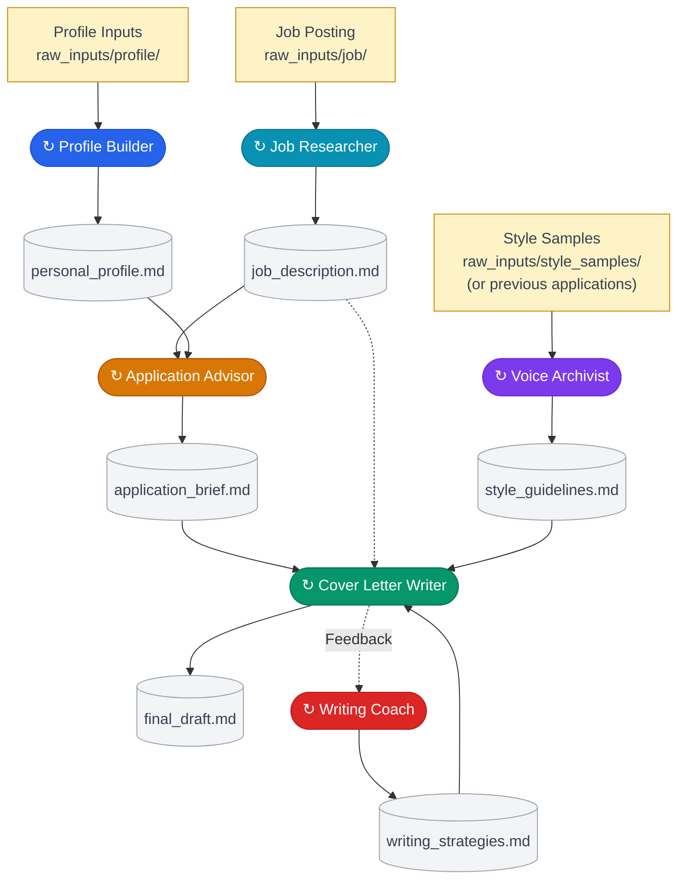
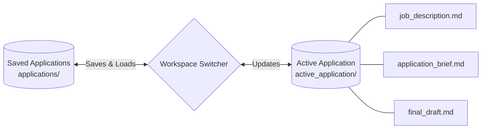

# Cover Letter Assistant

A personal, multi-agent cover letter pipeline that runs entirely inside **Cursor** — no API keys, no external services. Powered by your Cursor Pro plan.

Each agent is a Cursor Skill that reads and writes structured markdown files. You interact with them through natural language in Cursor's Agent chat.

---

## Quick start

### 1) Build profile (once)

Either paste your CV/context in chat, or drop a file in `raw_inputs/profile/`, then run:

```
Update my profile from @raw_inputs/profile/
```

### 2) Add writing style (optional, once)

Either paste one or more past letters in chat, or drop files in `raw_inputs/style_samples/`, then run:

```
Extract my writing style from @raw_inputs/style_samples/
```

### 3) Run one application

```
New application — company-role
```

Either paste the job posting in chat (text/screenshot/URL) or drop a file in `raw_inputs/job/`, then run:

```
Research the job from @raw_inputs/job/
Evaluate this role against my profile
Let's apply — generate the brief
Write the cover letter
```

If you want a preference saved for future letters:

```
Update my writing strategies — [your rule]
```

---

## Glossary

| Term | Meaning |
|---|---|
| `raw_inputs/` | Stuff you provide (CV, job posting, style samples) |
| `memory/` | Your global memory (`personal_profile.md`, `style_guidelines.md`, `writing_strategies.md`) |
| `active_application/` | The three active files for the current role |
| `applications/` | Saved snapshots when you switch roles |

## Architecture

### Main Pipeline

Each agent `↻` supports iterative chat with the user. 



### Active Application Management



---

## Agent Skills

| Skill | What it does |
|---|---|
| `profile-builder` | Builds `personal_profile.md` from your CV or career materials |
| `voice-archivist` | Analyzes reference drafts (or prior application drafts) to generate `style_guidelines.md` |
| `job-researcher` | Enriches a raw job posting with company intelligence from the web |
| `application-advisor` | Evaluates fit and produces a tailored `application_brief.md` |
| `cover-letter-writer` | Drafts and iteratively refines `final_draft.md` |
| `writing-coach` | Captures generalizable feedback from drafting into memory |
| `workspace-switcher` | Saves and loads applications so you can work on multiple roles |

---
## How it works

The system is built around two types of memory:

| Type | Files | Purpose |
|---|---|---|
| **Global** | `memory/` | Your profile + style memory — shared across every application |
| **Per-application** | `active_application/` | Active job context — swapped out when you switch applications |

---

## Project structure

```
raw_inputs/
    profile/
        your_cv.pdf / your_cv.md    ← Raw inputs for the profile builder
    job/
        posting.pdf                 ← Raw job description inputs
    style_samples/
        past_letter.pdf             ← Past cover letters for style analysis
memory/
    personal_profile.md         ← Your CV, experiences, and skills
    style_guidelines.md         ← Style baseline: extracted from reference drafts
    writing_strategies.md       ← Confirmed writing rules
active_application/
    .active                     ← Current application slug
    job_description.md          ← Enriched job + company intelligence
    application_brief.md        ← Tailored strategy for this application
    final_draft.md              ← The cover letter
applications/
    stripe-backend/             ← Saved snapshots of past applications
    google-swe/
    ...
```

All profile source files belong in `raw_inputs/profile/` (there is no top-level `profile/` folder).

---

## Workflow

### One-time setup

> Do this once, then update whenever your background changes.

**1. Build your profile**

Either option is fine (paste in chat, or drop files in `raw_inputs/profile/`). Then run:
```
Update my profile from @raw_inputs/profile/your_cv.pdf
```

The `profile-builder` skill will extract your experiences, education, and skills into `memory/personal_profile.md`. Chat with it to fill in any gaps.

---

**2. Extract your writing style**

Drop one or more of your past cover letters into `raw_inputs/style_samples/` and open Cursor Agent:

```
Extract my writing style from @raw_inputs/style_samples/
```

The `voice-archivist` skill analyzes your tone, vocabulary, sentence structure, and formatting preferences and saves them to `memory/style_guidelines.md`. If `raw_inputs/style_samples/` is empty, you can also have it use a handful of past `applications/**/final_draft.md` letters as style references.

---

### Per-application workflow

> Repeat this for every new job you apply to.

**3. Start a new application**

```
New application — stripe-backend
```

The `workspace-switcher` saves your current active application and clears it for the new role.

---

**4. Research the job**

Either option is fine (paste/share in chat, or drop files in `raw_inputs/job/`). Then run:
```
Research the job from @raw_inputs/job/
```

The `job-researcher` skill accepts both input paths, extracts role details, then searches the web for company intelligence (mission, culture, LinkedIn headcount, recent news) and saves everything to `active_application/job_description.md`.

---

**5. Evaluate fit with the Advisor**

```
Evaluate this role against my profile
```

The `application-advisor` reads your profile and the enriched job description, surfaces matches and gaps, and chats with you about angles. When you're ready:

```
Let's apply — generate the brief
```

This produces `active_application/application_brief.md` with specific experiences mapped to specific requirements.

---

**6. Write the cover letter**

```
Write the cover letter
```

The `cover-letter-writer` uses the brief, the job description, and your writing strategies to produce a first draft in `active_application/final_draft.md`. Then iterate:

```
Make the opening more direct
Remove the mention of Python
Keep the second paragraph but tighten it
```

After each revision, the complete updated letter is saved automatically.

---

**7. Capture new writing rules (optional)**

If you notice a correction that should apply to future letters, either share it directly in chat or point to a note file with `@file`:

```
Update my writing strategies — never start a sentence with "I am"
```

The `writing-coach` reads your latest `active_application/final_draft.md` plus your feedback, then updates `memory/writing_strategies.md` with reusable rules for future letters.

---

### Managing multiple applications

```
List my applications
Switch to google-swe
Save current application
```

The `workspace-switcher` handles all of this. Your profile and writing strategies are never touched — only the three active application files are swapped.

---

## Writing memory model

Your writing style is stored in two layers:

```
style_guidelines.md     ← Baseline: extracted from reference drafts
        |
        | complemented by live drafting feedback
        ↓
writing_strategies.md   ← Hard: "always apply this"
```

The `voice-archivist` populates your style baseline (`style_guidelines.md`) from reference drafts.
The `writing-coach` updates `writing_strategies.md` directly from live feedback during drafting.

---

## Tips

- **Profile first.** The Advisor and Writer both depend on a rich `personal_profile.md`. The more detail it has, the better the brief and draft will be.
- **Be specific in the brief.** When chatting with the Advisor, push for specific stories and examples — not just "I have leadership experience" but which project and what outcome.
- **Iterate freely.** The Writer keeps the full conversation history, so you can ask for small tweaks or full rewrites at any point.
- **One application at a time.** `active_application/` always reflects your active role. Switch cleanly with the workspace-switcher rather than editing files directly.
