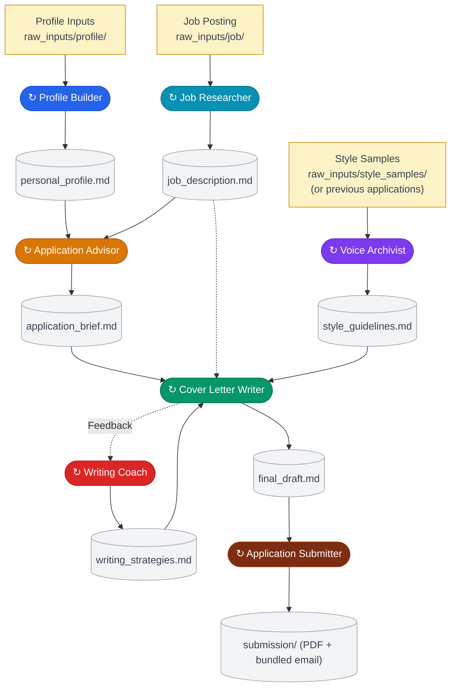
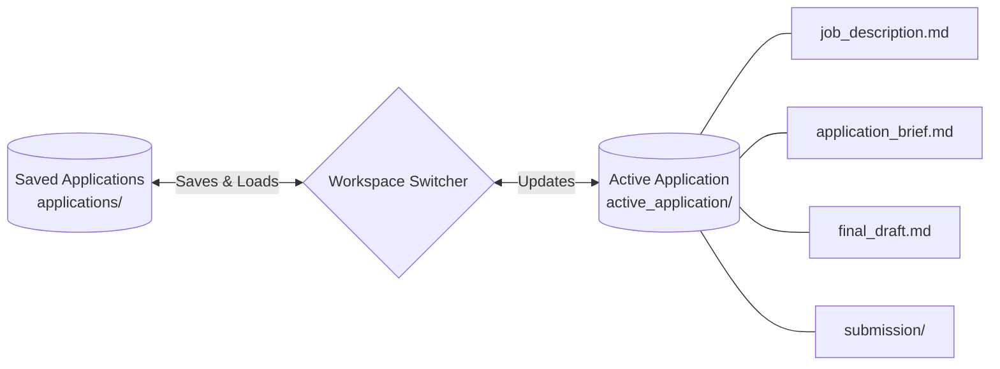

# Cover Letter Assistant

A personal, multi-agent cover letter pipeline built around plain Markdown files, reusable skill specs, and natural-language agent workflows.

Each agent reads and writes structured Markdown files. The repository currently includes a reference implementation for Cursor under `.cursor/skills/`, but the workflow itself is platform-agnostic.

## Platform notes

- The skill definitions are plain `SKILL.md` files, so they can be adapted to other agent platforms.
- If you use Cursor, keep the implementation in `.cursor/skills/` so Cursor can discover the skills automatically.
- If you use another platform, treat the files in `.cursor/skills/` as the source prompt specs and recreate them in that platform's preferred format.
- The portable part of the project is the file-based workflow: `raw_inputs/`, `memory/`, `active_application/`, and `applications/`.

In other words: the directory name `.cursor/skills/` is implementation-specific, but the actual workflow design is not.

For a short setup note covering Cursor, Claude Code, and Codex, see `PLATFORMS.md`.

---

## Quick start

### 0) Install PDF dependencies (once)

Use any Python environment you prefer:

```
python -m pip install -r requirements.txt
```

If you want to force a specific interpreter later, the submission workflow supports:

```
PDF_PYTHON=/path/to/python
```

### 1) Build profile (once)

Either paste your CV/context in chat, or drop a file in `raw_inputs/profile/`, then run:

```
Update my profile from @raw_inputs/profile/
```

### 2) Add writing style (optional, once)

Either paste one or more past letters in chat, or drop files in `raw_inputs/style_samples/`, then run:

```
Extract my writing style from @raw_inputs/style_samples/
```

### 3) Run one application

```
New application — company-role
```

Either paste the job posting in chat (text/screenshot/URL) or drop a file in `raw_inputs/job/`, then run:

```
Research the job from @raw_inputs/job/
Evaluate this role against my profile
Let's apply — generate the brief
Write the cover letter
Prepare submission output
```

If you want a preference saved for future letters:

```
Update my writing strategies — [your rule]
```

---

## Glossary

| Term | Meaning |
|---|---|
| `raw_inputs/` | Stuff you provide (CV, job posting, style samples) |
| `memory/` | Your reusable project memory: profile context, style guidelines, writing strategies, and PDF styling shared across applications. See `memory/README.md`. |
| `active_application/` | Active files for the current role |
| `applications/` | Saved snapshots when you switch roles |

## Architecture

### Main Pipeline

Each agent `↻` supports iterative chat with the user. 


```mermaid
flowchart TD
    classDef pb  fill:#2563EB,stroke:#1D4ED8,color:#fff
    classDef se  fill:#7C3AED,stroke:#6D28D9,color:#fff
    classDef jr  fill:#0891B2,stroke:#0E7490,color:#fff
    classDef aa  fill:#D97706,stroke:#B45309,color:#fff
    classDef cw  fill:#059669,stroke:#047857,color:#fff
    classDef su  fill:#DC2626,stroke:#B91C1C,color:#fff
    classDef as  fill:#7C2D12,stroke:#9A3412,color:#fff
    classDef file  fill:#F3F4F6,stroke:#9CA3AF,color:#374151
    classDef input fill:#FEF3C7,stroke:#CA8A04,color:#374151

    %% One-time setup
    Personal["Profile Inputs<br>raw_inputs/profile/"]:::input --> PB
    PB(["↻  Profile Builder"]):::pb --> Profile[("personal_profile.md")]:::file

    Refs["Style Samples<br>raw_inputs/style_samples/<br>(or previous applications)"]:::input --> SE
    SE(["↻  Voice Archivist"]):::se --> StyleGuide[("style_guidelines.md")]:::file
    StyleHard[("writing_strategies.md")]:::file

    %% Job input & research
    JobInput["Job Posting<br>raw_inputs/job/"]:::input --> JR
    JR(["↻  Job Researcher"]):::jr --> JD[("job_description.md")]:::file

    %% Advisor Phase
    Profile --> AA
    JD --> AA
    AA(["↻  Application Advisor"]):::aa --> Brief[("application_brief.md")]:::file

    %% Writer Phase
    Brief --> CW
    JD -.-> CW
    StyleGuide --> CW
    StyleHard --> CW
    CW(["↻  Cover Letter Writer"]):::cw --> Draft[("final_draft.md")]:::file

    %% Submission Phase
    Draft --> AS
    AS(["↻  Application Submitter"]):::as --> SubmissionDir[("submission/ (PDF + bundled email)")]:::file

    %% Style Feedback Loop
    CW -.->|"Feedback"| SU
    SU(["↻  Writing Coach"]):::su --> StyleHard
```

### Active Application Management


```mermaid
flowchart LR
    Saved[("Saved Applications<br>applications/")] <-->|"Saves & Loads"| Switcher{Workspace Switcher}
    Switcher <-->|"Updates"| Active[("Active Application<br>active_application/")]
    
    Active --- JD[job_description.md]
    Active --- Brief[application_brief.md]
    Active --- Draft[final_draft.md]
    Active --- SubmissionDir[submission/]
```

---

## Agent Skills

| Skill | What it does |
|---|---|
| `profile-builder` | Builds `personal_profile.md` from your CV or career materials |
| `voice-archivist` | Analyzes reference drafts (or prior application drafts) to generate `style_guidelines.md` |
| `job-researcher` | Enriches a raw job posting with company intelligence from the web |
| `application-advisor` | Evaluates fit and produces a tailored `application_brief.md` |
| `cover-letter-writer` | Drafts and iteratively refines `final_draft.md` |
| `application-submitter` | Generates cover-letter PDF output and drafts a short send-ready email |
| `writing-coach` | Captures generalizable feedback from drafting into memory |
| `workspace-switcher` | Saves and loads applications so you can work on multiple roles |

---
## How it works

The system is built around two types of memory:

| Type | Files | Purpose |
|---|---|---|
| **Global** | `memory/` | Your profile, style guidelines, writing strategies, and PDF styling — shared across every application |
| **Per-application** | `active_application/` | Active job context — swapped out when you switch applications |

---

## Project structure

```
raw_inputs/
    profile/
        your_cv.pdf / your_cv.md    ← Raw inputs for the profile builder
    job/
        posting.pdf                 ← Raw job description inputs
    style_samples/
        past_letter.pdf             ← Past cover letters for style analysis
memory/
    README.md                   ← Overview of reusable memory files
    personal_profile.md         ← Your CV, experiences, and skills
    style_guidelines.md         ← Style guidelines extracted from reference drafts
    writing_strategies.md       ← Reusable writing strategies collected over time
    cover_letter.css            ← Reusable PDF layout and typography settings
active_application/
    .active                     ← Current application slug
    job_description.md          ← Enriched job + company intelligence
    application_brief.md        ← Tailored strategy for this application
    final_draft.md              ← The cover letter
    submission/                 ← Bundled send artifacts
        submission_email.md     ← Send-ready email body + subject
        <Name>_Cover_Letter.pdf ← Generated cover letter PDF
applications/
    stripe-backend/             ← Saved snapshots of past applications
    google-swe/
    ...
```

All profile source files belong in `raw_inputs/profile/` (there is no top-level `profile/` folder).
For a fuller description of the reusable memory files, see `memory/README.md`.

---

## Workflow

Quick start above is the canonical list of prompts to run. This section explains what each step does and what files it creates.

### One-time setup

> Do this once, then update whenever your background changes.

**1. Build your profile**

Either option is fine: paste context in chat, or place source files in `raw_inputs/profile/`, then run the profile-building prompt from Quick start.

The `profile-builder` skill will extract your experiences, education, and skills into `memory/personal_profile.md`. Chat with it to fill in any gaps.

---

**2. Extract your writing style**

Drop one or more of your past cover letters into `raw_inputs/style_samples/`, then run the style-extraction prompt from Quick start.

The `voice-archivist` skill analyzes your tone, vocabulary, sentence structure, and formatting preferences and saves them to `memory/style_guidelines.md`. If `raw_inputs/style_samples/` is empty, you can also have it use a handful of past `applications/**/final_draft.md` letters as style references.

---

### Per-application workflow

> Repeat this for every new job you apply to.

**3. Start a new application**

Use the new-application prompt from Quick start.

The `workspace-switcher` saves your current active application and clears it for the new role.

---

**4. Research the job**

Either option is fine: paste/share the job posting in chat, or place it in `raw_inputs/job/`, then run the research prompt from Quick start.

The `job-researcher` skill accepts both input paths, extracts role details, then searches the web for company intelligence (mission, culture, LinkedIn headcount, recent news) and saves everything to `active_application/job_description.md`.

---

**5. Evaluate fit with the Advisor**

Run the fit-evaluation prompt from Quick start, then use the brief-generation prompt when you are ready.

The `application-advisor` reads your profile and the enriched job description, surfaces matches and gaps, and chats with you about angles.

This produces `active_application/application_brief.md` with specific experiences mapped to specific requirements.

---

**6. Write the cover letter**

Run the drafting prompt from Quick start.

The `cover-letter-writer` uses the brief, the job description, and any available style guidelines or writing strategies to produce a first draft in `active_application/final_draft.md`. If `memory/style_guidelines.md` or `memory/writing_strategies.md` does not exist yet, the writer can still draft from the brief and job description. Then iterate:

```
Make the opening more direct
Remove the mention of Python
Keep the second paragraph but tighten it
```

After each revision, the complete updated letter is saved automatically.

---

**7. Prepare final submission output**

Run the submission prompt from Quick start.

The `application-submitter` creates:
- `active_application/submission/submission_email.md` (ready-to-send email)
- `active_application/submission/*.pdf` (generated outputs)

By default, the PDF workflow uses `markdown` + `weasyprint` with styling from `memory/cover_letter.css`. See `memory/README.md` for customization notes.

---

**8. Capture new writing strategies (optional)**

If you notice a correction that should apply to future letters, share it directly in chat or point to a note file with `@file`, then run the writing-strategy update prompt from Quick start.

The `writing-coach` reads your latest `active_application/final_draft.md` plus your feedback, then updates `memory/writing_strategies.md` with reusable rules for future letters.

---

### Managing multiple applications

```
List my applications
Switch to google-swe
Save current application
```

The `workspace-switcher` handles all of this. Your profile, style guidelines, and writing strategies are never touched — the full active application workspace (including submission files/artifacts) is swapped.

---

## Writing memory model

Your reusable writing preferences are stored in two layers:

```
style_guidelines.md     ← Patterns extracted from reference drafts
        |
        | complemented by live drafting feedback
        ↓
writing_strategies.md   ← Explicit preferences to apply in future letters
```

The `voice-archivist` populates `style_guidelines.md` from reference drafts.
The `writing-coach` updates `writing_strategies.md` directly from live feedback during drafting.

---

## Tips

- **Profile first.** The Advisor and Writer both depend on a rich `personal_profile.md`. The more detail it has, the better the brief and draft will be.
- **Be specific in the brief.** When chatting with the Advisor, push for specific stories and examples — not just "I have leadership experience" but which project and what outcome.
- **Iterate freely.** The Writer keeps the full conversation history, so you can ask for small tweaks or full rewrites at any point.
- **One application at a time.** `active_application/` always reflects your active role. Switch cleanly with the workspace-switcher rather than editing files directly.
